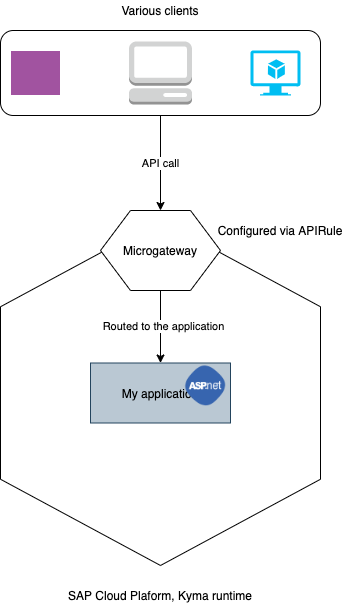

## Overview

This sample demonstrates how to build and deploy an ASP.NET-based microservice as an extension and expose the API in SAP Cloud Platform, Kyma runtime.

You can find the application code in the [sample-extension-dotnet](./sample-extension-dotnet) directory.



This sample demonstrates how to:

* Create a development Namespace in the Kyma runtime.
* Create and deploy an ASP.NET application in the Kyma runtime.
* Expose the ASP.NET application using [APIRules](https://kyma-project.io/docs/components/api-gateway#custom-resource-api-rule).
* Call the APIs.

## Prerequisites

* SAP Cloud Platform, Kyma runtime instance
* [Docker](https://www.docker.com/)
* [make](https://www.gnu.org/software/make/)
* [kubectl](https://kubernetes.io/docs/tasks/tools/install-kubectl/) configured to use the `KUBECONFIG` file downloaded from the Kyma runtime

## Steps

### Deploy the application

1. Create a new `dev` Namespace:

```shell script
kubectl create namespace dev
```

2. Build and push the image to the Docker repository:

```shell script
DOCKER_ACCOUNT={your-docker-account} make push-image
```

3. Update the image name in the [Kubernetes Deployment](k8s/deployment.yaml). Refer to the standard Kubernetes [Deployment](https://kubernetes.io/docs/concepts/workloads/controllers/deployment/) and [Service](https://kubernetes.io/docs/concepts/services-networking/service/) definitions.

4. Deploy the application:

```shell script
kubectl -n dev apply -f ./k8s/deployment.yaml
```

5. Verify that the Pods are up and running:

```shell script
kubectl -n dev get po -l app=sample-extension-dotnet
```

The expected result shows that the Pod for the `sample-extension-dotnet` Deployment is running:

```shell script
kubectl -n dev get po -l app=sample-extension-dotnet
NAME                                       READY   STATUS    RESTARTS   AGE
sample-extension-dotnet-774fbc5c7b-x44pd   2/2     Running   0          15s
```

### Expose the API

1. Create an APIRule. In the APIRule, specify the Kubernetes Service that is exposed:

```yaml
apiVersion: gateway.kyma-project.io/v1alpha1
kind: APIRule
metadata:
  name: sample-extension-dotnet
spec:
  gateway: kyma-gateway.kyma-system.svc.cluster.local
  rules:
    - accessStrategies:
        - config: {}
          handler: noop
      methods:
        - GET
        - POST
        - PUT
        - DELETE
      path: /.*
  service:
    host: sample-extension-dotnet
    name: sample-extension-dotnet
    port: 80
```  

This sample snippet exposes the `sample-extension-dotnet` Service. The Service is specified in the **spec.service.name** field.
The `sample-extension-dotnet` subdomain is specified in the **spec.service.host** field.


2. Apply the APIRule:

```shell script
kubectl -n dev apply -f ./k8s/api-rule.yaml
```

3. Access the APIs through this URL:

```
https://sample-extension-dotnet.{cluster domain}
```

### Try it out

Make an HTTP call using curl:

```shell script
curl https://sample-extension-dotnet.{cluster domain}
Hello from dotnet app running on Kyma Runtime
```
