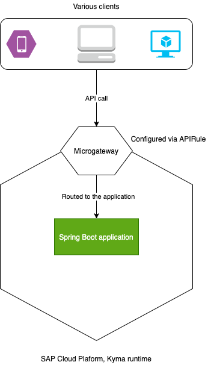

# Overview

This sample demonstrates how to build and deploy a Java based microservice as an extension and expose the API in _SAP Cloud Platform Extension Factory, Kyma Runtime_.



This sample demonstrates:

* Creating a development namespace in Kyma Runtime.
* Creating and deploying a Spring Boot application in Kyma runtime.
* Exposing the Spring Boot application via [APIRules](https://kyma-project.io/docs/components/api-gateway#custom-resource-api-rule).
* Exploring the APIs

## Prerequisites

* SAP Cloud Platform Extension Factory, Kyma Runtime instance
* [Docker](https://www.docker.com/)
* [make](https://www.gnu.org/software/make/)
* [Gradle](https://gradle.org/)
* [kubectl](https://kubernetes.io/docs/tasks/tools/install-kubectl/)
* `kubectl` is configured to `KUBECONFIG` downloaded from Kyma Runtime.
* [Java 11+](https://openjdk.java.net/projects/jdk/11/)

## Application

The Spring boot application implements a simple Orders API with CRUD operations. 

It comes bundled with a Swagger console to explore with the API. The swagger console is only for the demo purpose and not recommended for production usage.

## Deploying the application

* Create a new Namespace `dev`

```shell script
kubectl create namespace dev
``` 

* Build the and push image to the docker repository.
  
```shell script
DOCKER_ACCOUNT={your-docker-account} make push-image
```

* Create a secret containing DB access credentials and Kyma cluster domain. The Kyma cluster domain is used by Swagger UI for making API calls in this sample.

```shell script
kubectl -n dev create secret generic sample-extension-java --from-literal=username={db username} --from-literal=password={db access password} --from-literal=clusterDomain={cluster domain}
```

* Update image name in the [Kubernetes Deployment](k8s/deployment.yaml). These are standard Kubernetes [Deployment](https://kubernetes.io/docs/concepts/workloads/controllers/deployment/) and [Service](https://kubernetes.io/docs/concepts/services-networking/service/) definitions.

* Deploy the application.

```shell script
kubectl -n dev apply -f ./k8s/deployment.yaml
```

* Verify the Pods are up and running

```shell script
kubectl -n dev get po
```

You should see the pod for deployment `sample-event-trigger-java` running.

```shell script
NAME                                     READY   STATUS    RESTARTS   AGE
sample-extension-java-6c7bd95746-vl2jc   2/2     Running   0          93s
```

### Exposing the API

Create an APIRule. In the APIRule, you specify the Kubernetes Service that is exposed. 

In the below snippet, service `sample-extension-java` is expose. It is specified in `spec.service.name` field.
The subdomain `sample-extension-java` is specified in `spec.service.host` field.

The APIs can be accessed on the URL <https://sample-extension-java.{cluster domain}> with the API path `/orders`.

```yaml
apiVersion: gateway.kyma-project.io/v1alpha1
kind: APIRule
metadata:
  name: sample-extension-java
spec:
  gateway: kyma-gateway.kyma-system.svc.cluster.local
  rules:
    - accessStrategies:
        - config: {}
          handler: noop
      methods:
        - GET
        - POST
        - PUT
        - DELETE
      path: /.*
  service:
    host: sample-extension-java
    name: sample-extension-java
    port: 8080
```  

```shell script
kubectl -n dev apply -f ./k8s/api-rule.yaml 
```

### Trying it out

Access the swagger console at <https://sample-extension-java.{cluster domain}/swagger-ui/index.html?configUrl=/v3/api-docs/swagger-config>

Try out the various APIs.


### Known Issues.

The HATEOS Links do not function properly as the API Gateway does not forward the hostname in the forwarded headers.