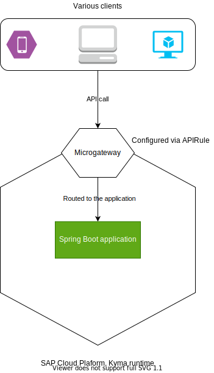

# Java-based extension with API exposed via Microgateway

[](https://github.com/SAP-samples/kyma-runtime-extension-samples/actions/workflows/build-docker-sample-extension-java.yml)

## Overview

This sample demonstrates how to build and deploy a Java-based microservice as an extension and expose the API in SAP BTP, Kyma runtime.



This sample demonstrates how to:

* Create a development Namespace in the Kyma runtime.
* Create and deploy a Spring Boot application in the Kyma runtime.
* Expose the Spring Boot application using [APIRules](https://kyma-project.io/docs/components/api-gateway#custom-resource-api-rule).
* Explore the APIs.

## Prerequisites

* SAP BTP, Kyma runtime instance
* [Docker](https://www.docker.com/)
* [make](https://www.gnu.org/software/make/)
* [Gradle](https://gradle.org/)
* [kubectl](https://kubernetes.io/docs/tasks/tools/install-kubectl/) configured to use the `KUBECONFIG` file downloaded from the Kyma runtime
* [Java 11+](https://openjdk.java.net/projects/jdk/11/)

## Application

The Spring Boot application implements a simple `Orders` API with CRUD operations.

## Steps

### Prepare for deployment

* Create a new `dev` Namespace:

    ```shell
    kubectl create namespace dev
    kubectl label namespaces dev istio-injection=enabled
    ```

* Build and push the image to the Docker repository:

    ```shell
    DOCKER_ACCOUNT={your-docker-account} make push-image
    ```

### Kubernetes Deployment

This section details out deploying the extension using standard Kubernetes resources.

To deploy as Helm chart, please refer to [Helm Chart Deployment](#helm-chart-deployment)

* Update the image name in the [Kubernetes Deployment](k8s/deployment.yaml). Refer to the standard Kubernetes [Deployment](https://kubernetes.io/docs/concepts/workloads/controllers/deployment/) and [Service](https://kubernetes.io/docs/concepts/services-networking/service/) definitions.

* Deploy the application:

    ```shell
    kubectl -n dev apply -f ./k8s/deployment.yaml
    ```

* Verify that the Pods are up and running:

    ```shell
    kubectl -n dev get po
    ```

The expected result shows that the Pod for the `sample-extension-java` Deployment is running:

#### Expose the API

* Create an APIRule. In the APIRule, specify the Kubernetes Service that is exposed:

    ```yaml
    apiVersion: gateway.kyma-project.io/v1alpha1
    kind: APIRule
    metadata:
      name: sample-extension-java
    spec:
      gateway: kyma-gateway.kyma-system.svc.cluster.local
      rules:
        - accessStrategies:
            - config: {}
              handler: noop
          methods:
            - GET
            - POST
            - PUT
            - DELETE
          path: /.*
      service:
        host: sample-extension-java
        name: sample-extension-java
        port: 8080
    ```  

    This sample snippet exposes the `sample-extension-java` Service. The Service is specified in the **spec.service.name** field.
    The `sample-extension-java` subdomain is specified in the **spec.service.host** field.

* Apply the APIRule:

    ```shell
    kubectl -n dev apply -f ./k8s/api-rule.yaml
    ```

### Helm Chart Deployment

A [Helm Chart definition](../helm-charts/sample-extension-java/README.md) is also available for developers to try out.

#### Must Haves

* [kubectl](https://kubernetes.io/docs/tasks/tools/install-kubectl/)
* [Helm3](https://helm.sh/docs/intro/install/)

#### Helm install

To install the helm chart in `dev` namespace, run the following command. Change to use your image. You can also override other parameters defined in [values.yaml](../helm-charts/sample-extension-java/values.yaml)

```shell
helm -n dev install kymaapp ../helm-charts/sample-extension-java --set image.repository=gabbi/sample-extension-java:0.0.7 --set jdbc.user={db user} --set jdbc.password={db password}
```

To verify, the installed chart, run: 

```shell
helm -n dev ls
```

### Try it out

Access the APIs through this URL: <https://sample-extension-java.{cluster domain}/orders>

Try out various APIs.
