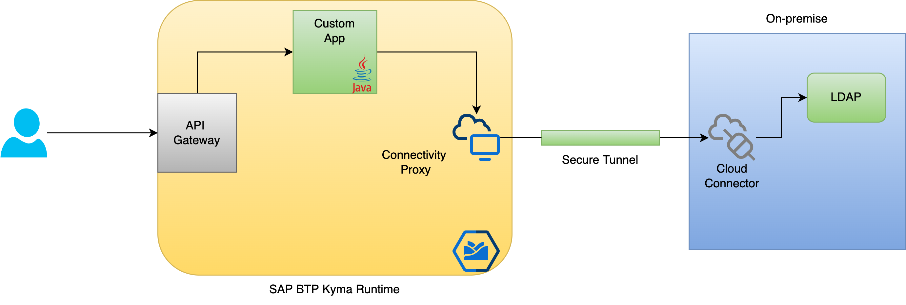
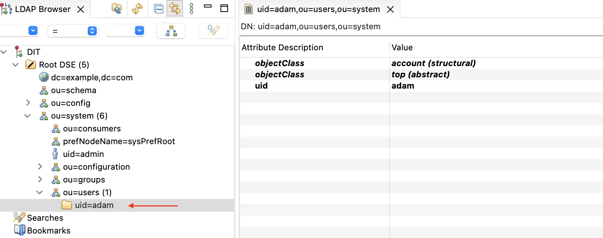
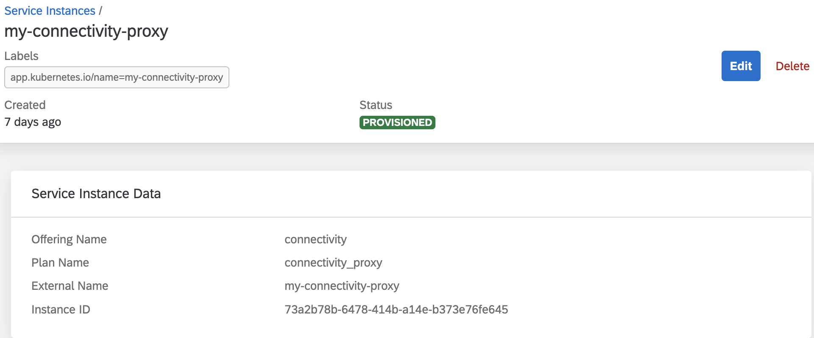

# Overview

This sample provides details on how an on-premise LDAP server can be accessed from an application running on SAP BTP, Kyma runtime.

The sample uses SAP Connectivity Proxy and SAP Cloud Connector to establish connection to the on-premise LDAP server.

In the sample flow, the users details are queried from the on-premise LDAP server via an HTTP GET call `/users/{userid}`.



## Prerequisites

* [SAP BTP, Kyma runtime instance](../prerequisites/README.md#kyma)
* [Kubernetes tooling](../prerequisites/README.md#kubernetes)
* [Cloud Connector on your laptop or test system](../prerequisites/README.md#sap-cloud-connector)
* [LDAP Server added as a virtual host in the cloud connector](https://help.sap.com/docs/CP_CONNECTIVITY/cca91383641e40ffbe03bdc78f00f681/f94810a111dd40fda07caffbbc02af87.html)

## Set up

### LDAP Server

In my sample, I have used [ApacheDS](https://directory.apache.org/apacheds/) as an LDAP server and ran it on my laptop. You are free to use any other LDAP Server of your choice. I have added a user which I query via the API.



### Kyma configuration

* Set up environment variables

  * OSX

    ```shell script
    export NS={your-namespace}
    ```

  * Windows PowerShell

    ```powershell
    $NS={your-namespace}
    ```

* Create Connectivity Service Instance in any namespace.
  >Note: Only one instance is required for the cluster. If you have deployed it previously, simply skip this step.

  

* Wait until the connectivity proxy is deployed. This can take around 10 minutes.

  ```shell script
  kubectl -n kyma-system get statefulsets.apps
  ```
  
  You should see one entry for the connectivity-proxy stateful set

  ```shell script
  NAME                               READY   AGE
  connectivity-proxy                 1/1     7d20h
  ```

* Expose the LDAP port via a service. Currently, LDAP port is not exposed by default.

  ```shell script
  kubectl -n kyma-system apply -f k8s/connectivity-proxy-ldap-service.yaml
  ```

* Create the secret with the required LDAP configuration. You can get these details from the LDAP server or request your admin for the LDAP server.

  ```shell script
  kubectl -n $NS create secret generic ldap-config --from-literal=LDAP_URL="ldap://{ldap-virtual-host}:{ldap-virtual-port}" \
   --from-literal=SECURITY_CREDENTIALS="{ldap-secret}" --from-literal SECURITY_PRINCIPAL="{ldap-security-principal}" \
   --from-literal=SECURITY_AUTHENTICATION="{ldap-security-authentication}" \
   --from-literal=SEARCH_CONTEXT="{ldap-search-context-for-users}"  
  ```

* Deploy the Java Application that connects to the on premise LDAP Server via connectivity proxy.

The [LdapService.java](src/main/java/com/sap/sample/ldap/services/LdapService.java) queries for users with filter `"(&(objectClass=account)(uid=" + userName + "))";` in the specified context

  ```shell script
  # only required once to enable istio sidecar. Ignore if done already
  kubectl label namespaces $NS istio-injection=enabled
  
  kubectl -n $NS apply -f k8s/deployment.yaml
  ```

* Expose it over internet using API Rule.

  ```shell script
  kubectl -n $NS apply -f k8s/api-rule.yaml
  ```

### Test

Query the user data <https://sample-ldap.{your-cluster-domain}/users/userid>
