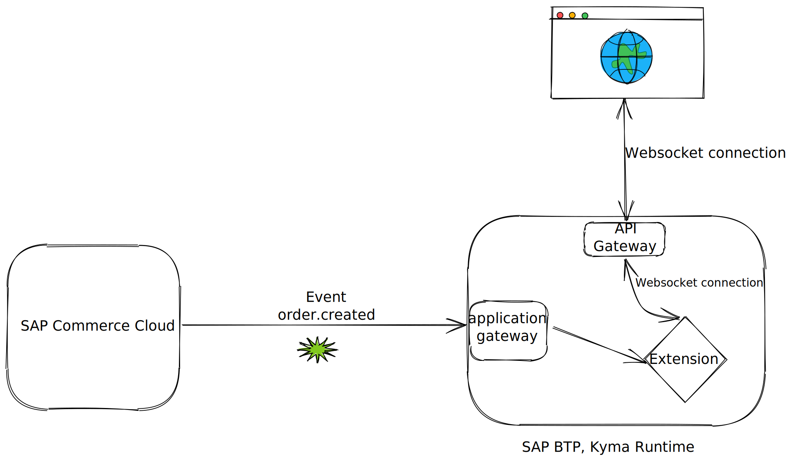
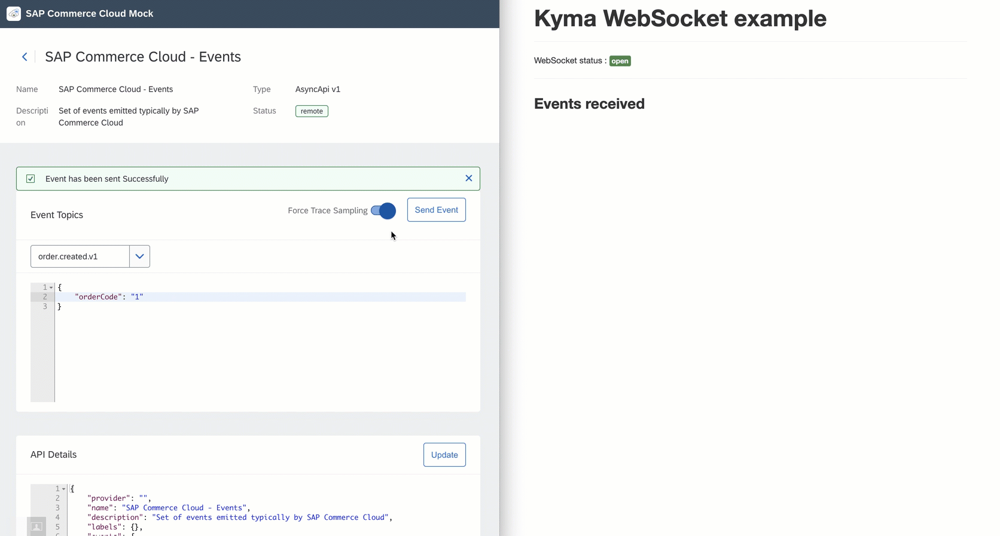

# Sample deploying a websocket based extension on Kyma

## Overview

In certain extension use cases it might be required to build real-time communication. Some of the examples include

* Sending a news feed to the subscribed users
* Updating the status of the customer wishlist
* Order delivery status in real-time
* Real time customer interactions

For such extension use cases, Server-Sent Events (SSE) or WebSockets could be the preferred options. Websockets are preferred solution when the communication is two-way.

This sample demonstrates using websockets with Kyma when building extensions and applications.

## Prerequisites

* SAP BTP, Kyma runtime instance
* [kubectl](https://kubernetes.io/docs/tasks/tools/install-kubectl/)
* SAP Commerce Cloud system connected to the Kyma runtime. You can also use the mock. Refer to [this blog post](https://blogs.sap.com/2020/06/17/sap-cloud-platform-extension-factory-kyma-runtime-mock-applications/) to set up the commerce mock.

## Extenion

The extension flow is pretty simple and described below:



1. SAP Commerce  cloud sends `order.created` event whenever an end-user makes a purchase.
2. The event triggers an extension.
3. This extension enriches the order details with further information and pushes it to the online user in real-time via the established websocket connection.

## Websocket connection

To achieve the websocket capability, no extra configuration is required.

The extension is exposed over the internet using API Rule  at the `https://websocket-server.{cluster-domain}` URL.

Kyma supports the upgrade of the HTTP connection to websocket connection out-of-the-box.

## Deploying the sample

```shell
# only required once to enable istio sidecar. Ignore if done already
kubectl label namespaces {provide-namespace} istio-injection=enabled

kubectl -n {provide-namespace} apply -f k8s/server.yaml
```

The YAML definition contains:

* K8s deployment and service which provides a [backend implementation](server/app/app.py) for websocket in python and a HTML file for quick testing.
* A event trigger to receive `order.created` event on `/events` endpoint.
* An API Rule to expose the service over internet.
* Simply access the API rule and send the events from you connected SAP Commerce Cloud system.

It is also possible to secure the exposed endpoint with JWT or OAuth2.

## Demo


