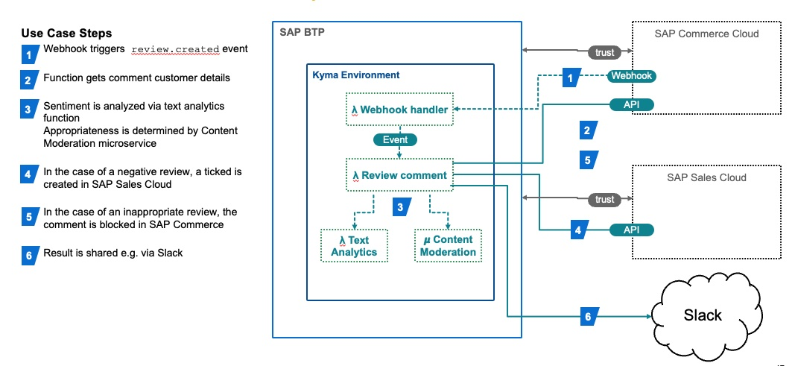

# Product Review Sentiment Analysis with SAP Commerce Cloud and SAP BTP, Kyma runtime

## Introduction

Marketers strive to get feedback on their customers' sentiment regarding the products they sell. SAP Commerce Cloud is in a unique position to capture this data, analyze it and respond in real-time.  This example shows how to leverage the product review functionality of SAP Commerce Cloud with a **side-by-side extension** deployed in SAP BTP, Kyma runtime.  The benefit of this approach is that there are no code changes required in SAP Commerce Cloud.  All that is required is some configuration and data.  This **allows** the following:

- Event driven business process decoupled from the core SAP Commerce Cloud processing

- Increased agility to build and deploy the extension, and to adapt it as as requirements change.

- Increased customer engagement and improved customer experience by quickly addressing concerns.

The following things are **avoided** with SAP Commerce Cloud:

- Downtime for deployments

- Impact to ongoing upgrades due to complicated custom code (keeping the core clean!)

- Runtime impact due to additional processing

- Extension delivery tied to core SAP Commerce Cloud deployment schedule

## Architecture




The architecture diagram describes use case flow.

## Components

- [SAP Commerce Cloud configuration](commerce-impex) - Impex files to configure the Integration API, webhook, exposed and consumed destinations and OAuth2 credentials for SAP Commerce Cloud.

- [Content moderation service](services/content-moderation) - Microservice to provide an indication if the text content is appropriate for publication on the storefront website.

### Function Details

- [Customer Review Webhook Handler](lambdas/customer-review-webhook) - Handler function for the outbound webhook configured in SAP Commerce Cloud.  It creates an internal CloudEvent to trigger downstream processing.

- [Text Analysis Function](lambdas/text-analysis) - Function that analyzes text input and provides an indication of positive or negative sentiment.

- [Sentiment Analysis Function](lambdas/sentiment-analysis) - The main function that processes the event and calls downstream services to analyze text and update SAP Commerce Cloud and SAP Sales Cloud, and send notification messages to Slack

## Prerequisites

- [SAP BTP, Kyma runtime instance](../prerequisites/README.md#kyma)

- [Kubernetes tooling](../prerequisites/README.md#kubernetes)

- [SAP Commerce Cloud environment connected to SAP BTP Kyma runtime.](https://help.sap.com/docs/BTP/65de2977205c403bbc107264b8eccf4b/83df31ad3b634c0783ced522107d2e73.html)  v2011 or greater in order to use the Webhooks feature.

- (Optional) [SAP Sales Cloud (Cloud for Customer) connected to SAP BTP Kyma runtime](https://help.sap.com/docs/BTP/65de2977205c403bbc107264b8eccf4b/83df31ad3b634c0783ced522107d2e73.html) if you enable the `c4cUpdateFlag` (see below)

## Configuration

The extension requires a `Secret` named `sentiment-analysis` configured in the Kyma namespace containing the following values:

- `baseSite`:  The SAP Commerce Cloud baseSite value e.g. `electronics`, required by the SAP Commerce Cloud OCC API.

- `c4cUpdateFlag`: Feature flag to enable the calls to SAP Sales Cloud to create customer and service ticket for negative reviews. If value is `true` then the feature is enabled.

- `gateway_url_occ` - URL for the SAP Commerce Cloud OCC API provided by the Kyma Central Application Gateway

- `gateway_url_c4c` - URL for the SAP Sales Cloud API provided by the Kyma Central Application Gateway

- `gateway_url_review` - URL for the SAP Commerce Cloud Integration API for Customer Reviews provided by the Kyma Central Application Gateway

- `slackUrl` - The Slack webhook for posting messages to the notification channel.

- `svcUrlContentModeration` - URL for the local [Content moderation service](services/content-moderation)

- `svcUrlTextAnalysis` - URL for the local [Text Analysis function](lambdas/text-analysis)

## Deploy

Detailed deployment steps are described in each component's README.md file.

- Set up environment variables

  - OSX

    ```shell script
    export NS={your-namespace}
    ```

  - Windows PowerShell

    ```powershell
    $NS={your-namespace}
    ```

### SAP Commerce Cloud Integration API

Import the following files in [commerce-impex](commerce-impex) in your SAP Commerce Cloud environment via the Adminstration Cockpit (hAC) or alternative method.  

```shell
commerce-impex/projectdata-integration-objects.impex 
commerce-impex/projectdata-register-integration-object.impex
```

See the SAP Commmerce Help topic on  [Data Management with Impex](https://help.sap.com/docs/SAP_COMMERCE/d0224eca81e249cb821f2cdf45a82ace/1b6dd3451fc04c3aa8e95937e9ef2471.html?q=impex).

Add the Integration Object to the registered Kyma Destination Target using SAP Commerce Cloud Backoffice as described in **Expose Your API – Existing Destination Target** section in this [blog post](https://blogs.sap.com/2022/10/14/commerce-cloud-exposing-integration-apis-to-sap-btp-kyma-runtime-with-oauth2/) on SAP Community

### Content Moderation Service

Deploy the [content-moderation](services/content-moderation) service

```shell
kubectl apply -n $NS -f services/content-moderation/k8s/content-moderation.yaml
```

### Functions

Deploy each function:

- [Customer Review Webhook Handler](lambdas/customer-review-webhook)

Update the IDP issuer details in [lambdas/customer-review-webhook/k8s/api-access.yaml](lambdas/customer-review-webhook/k8s/api-access.yaml)

```shell
kubectl apply -n $NS -f lambdas/customer-review-webhook/k8s/function.yaml
kubectl apply -n $NS -f lambdas/customer-review-webhook/k8s/api-access.yaml
```

- [Text Analysis Function](lambdas/text-analysis)

```shell
kubectl apply -n $NS -f lambdas/text-analysis/k8s/function.yaml
```

- [Sentiment Analysis Function](lambdas/sentiment-analysis)

Update namespace in [lambdas/sentiment-analysis/k8s/subscription.yaml](lambdas/sentiment-analysis/k8s/subscription.yaml)

```shell
kubectl apply -n $NS -f lambdas/sentiment-analysis/k8s/function.yaml
kubectl apply -n $NS -f lambdas/sentiment-analysis/k8s/subscription.yaml
```

### Webhook

- Retrieve `client_id` & `client_secret` from your IDP. It will be used with the [webhook impex](./commerce-impex/webhooks.impex)

- Update the following variables in `commerce-impex/webhooks.impex` with the `client_id` & `client_secret`

```shell
$oauth_client_id
$oauth_client_secret
```

Deploy `commerce-impex/webhooks.impex` into SAP Commerce Cloud.

## Verify

In SAP Commerce Cloud storefront (Spartacus or Accelerator), log in as a user and create a product review on the Reviews tab of the product detail page.  

### Example Payload

```json
{
    "d": {
        "__metadata": {
            "id": "https://backoffice.<your-env>.model-t.cc.commerce.ondemand.com:443/odata2webservices/CustomerProductReview/CustomerReviews('Online%7CapparelProductCatalog%7C1667409165852%7C29533%7Creviewer1%2540hybris.com')",
            "uri": "https://backoffice.<your-env>.model-t.cc.commerce.ondemand.com:443/odata2webservices/CustomerProductReview/CustomerReviews('Online%7CapparelProductCatalog%7C1667409165852%7C29533%7Creviewer1%2540hybris.com')",
            "type": "HybrisCommerceOData.CustomerReview"
        },
        "alias": null,
        "headline": "This is a fantastic product, did everything I wanted it to do.",
        "blocked": false,
        "comment": "Best product ever!",
        "creationtime": "/Date(1667409165852)/",
        "rating": "5.0",
        "integrationKey": "Online|apparelProductCatalog|1667409165852|29533|reviewer1%40hybris.com",
        "product": {
            "__deferred": {
                "uri": "https://backoffice.<your-env>.model-t.cc.commerce.ondemand.com:443/odata2webservices/CustomerProductReview/CustomerReviews('Online%7CapparelProductCatalog%7C1667409165852%7C29533%7Creviewer1%2540hybris.com')/product"
            }
        },
        "approvalStatus": {
            "__deferred": {
                "uri": "https://backoffice.<your-env>.model-t.cc.commerce.ondemand.com:443/odata2webservices/CustomerProductReview/CustomerReviews('Online%7CapparelProductCatalog%7C1667409165852%7C29533%7Creviewer1%2540hybris.com')/approvalStatus"
            }
        },
        "language": {
            "__deferred": {
                "uri": "https://backoffice.<your-env>.model-t.cc.commerce.ondemand.com:443/odata2webservices/CustomerProductReview/CustomerReviews('Online%7CapparelProductCatalog%7C1667409165852%7C29533%7Creviewer1%2540hybris.com')/language"
            }
        },
        "user": {
            "__deferred": {
                "uri": "https://backoffice.<your-env>.model-t.cc.commerce.ondemand.com:443/odata2webservices/CustomerProductReview/CustomerReviews('Online%7CapparelProductCatalog%7C1667409165852%7C29533%7Creviewer1%2540hybris.com')/user"
            }
        }
    }
}
```
