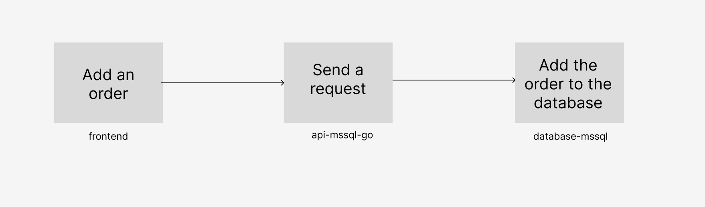
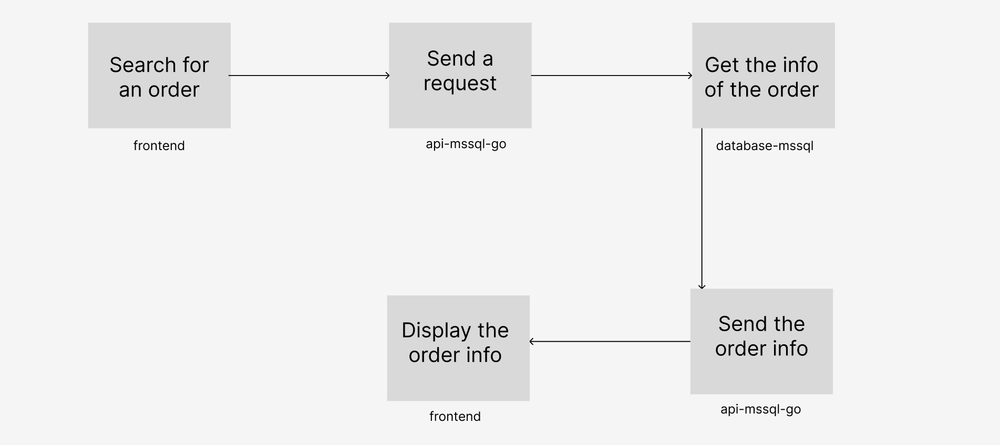
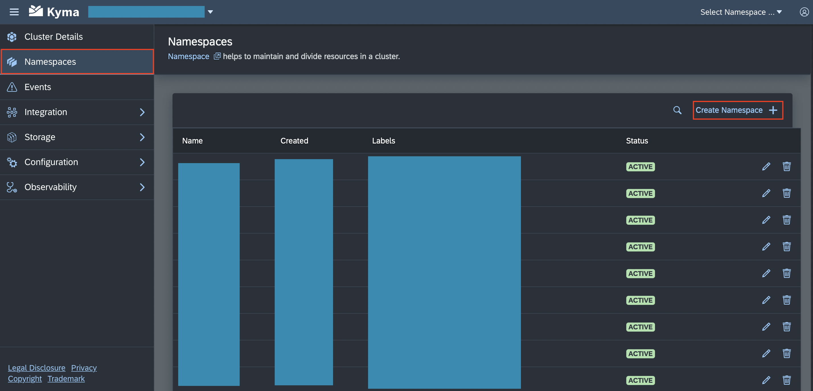
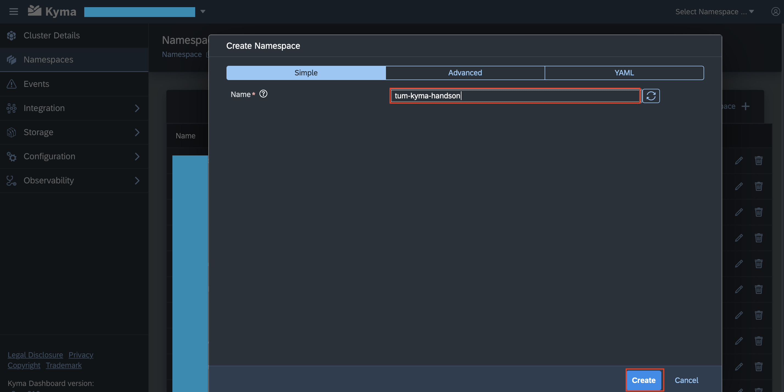
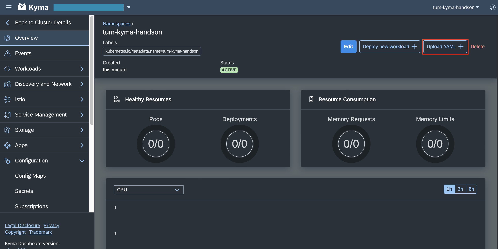
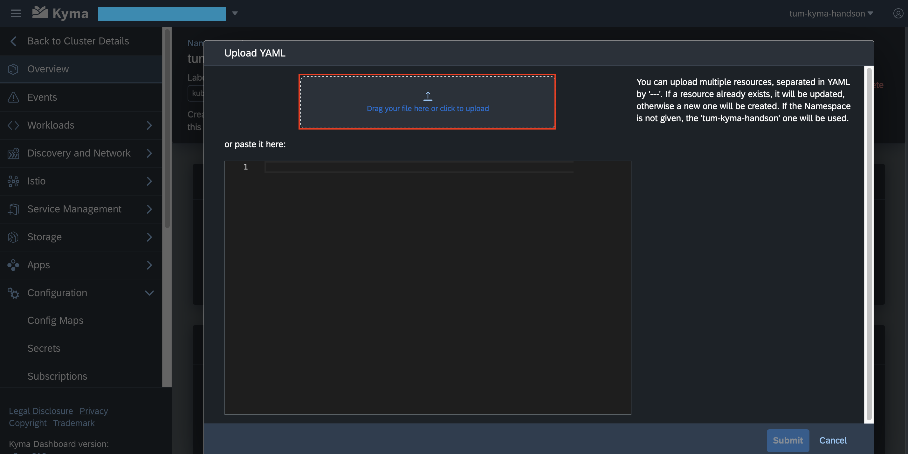
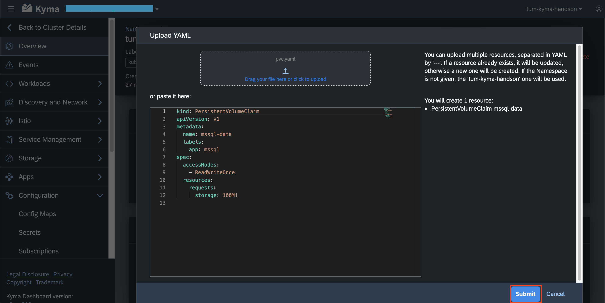
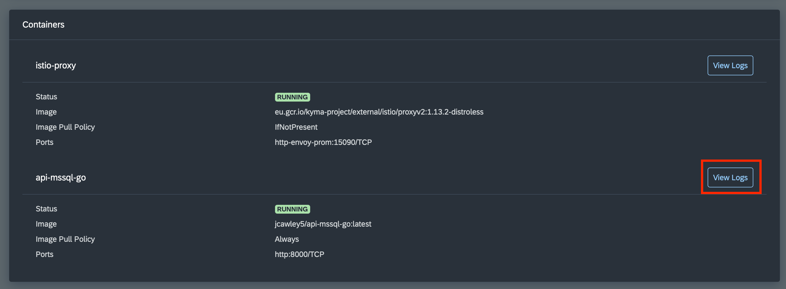

# TUM hands-on tutorial

## Overview

Throughout this hands-on-tutorial you will create a MS SQL database, a Golang API endpoint for communication with the MS SQL database and a frontend accessing the database via the API. All three microservices will be deployed and administered in a kyma cluster. You will learn how to create a namespace, how to create resources and how to check if everything is working. The flow diagrams of this tutorial is illustrated below. The first diagram demonstrates the process of Adding/Updating/Deleting an Order and the second diagram demonstrates the flow of Searching for an Order.   

## Prerequisites

- Kyma trial account
- Internet browser

## Deploy a database in kyma cluster

1. Download this GitHub repository:
    1. Open the [tutorial](https://github.com/SAP-samples/kyma-runtime-extension-samples/tree/main/tum-hands-on-tutorial)
    2. Download `tum-hands-on-tutorial.zip`.
    3. After the download finished, extract the zip file to a location on your computer.
2. Create a new Namespace with the name `tum-kyma-handson`. Kyma uses namespaces to organize objects in the cluster. You can think of each namespace as a folder that holds a set of objects. Follow these steps to create the namespace:
    1. Open the `Namespaces` overview in the toolbar on the left. 
    2. Click on `Create Namespace +` in the top-right corner. 
    3. Enter the name `tum-kyma-handson` for your namespace and click on `Create`. 
    4. You are now automatically in the `Overview` page of your namespace.
3. Apply the PersistentVolumeClaim. Persistent volumes are resources in the cluster. Persistent volume claims (PVCs) are requests for those resources and also act as claim checks to the resource. Follow these steps to create a PVC:
    1. Click on `Upload YAML +` in the top-right corner. 
    2. Click on the button `Drag your file here or click to upload` and select the file `database-mssql/k8s/pvc.yaml` from the extracted github repository. 
    3. Click on `Submit` to upload this file. 
    4. Click on `Close` to return to the overview. 
4. Apply the Secret. Secrets are kubernetes objects that store a small amount of sensitive data like credentials (in our case username and password for the database). Follow these steps to create a secret: 
    1. Click on `Upload YAML +` in the top-right corner. 
    2. Click on the button `Drag your file here or click to upload` and select the file `database-mssql/k8s/secret.yaml` from the extracted github repository. 
    3. Click on `Submit` to upload this file. 
    4. Click on `Close` to return to the overview. 
5. Apply the Deployment. Deployments describe the desired state of a resource (e.g., a Pod). They for example specify which docker image to use and what environment variables to set. Follow these steps to create a deployment for the database: 
    1. Click on `Upload YAML +` in the top-right corner. 
    2. Click on the button `Drag your file here or click to upload` and select the file `database-mssql/k8s/deployment.yaml` from the extracted github repository. 
    3. Click on `Submit` to upload this file. 
    4. Click on `Close` to return to the overview. 
6. Verify that the Pod is up and running: 
    1. Expand the `Workloads` section on the navigation bar on the left side.
    2. Click on `Pods` to see an overview of your Pods. 
    3. You should see your Pod with a name starting with `mssql-` with the green Status `Running`.

## Deploy the API - MS SQL database example

1. Apply the ConfigMap. A ConfigMap is an API object used to store non-confidential data in key-value-pairs. Pods can use these key-value pairs as command line arguments or environment variables. Follow these steps to create a ConfigMap:
    1. Return to the overview of your namespace by clicking on `Overview` in the navigation bar on the left side. 
    2. Click on `Upload YAML +` in the top-right corner. 
    3. Click on the button `Drag your file here or click to upload` and select the file `api-mssql-go/k8s/configmap.yaml` from the extracted github repository. 
    4. Click on `Submit` to upload this file. 
    5. Click on `Close` to return to the overview. 
2. Apply the Secret:
    1. Click on `Upload YAML +` in the top-right corner. 
    2. Click on the button `Drag your file here or click to upload` and select the file `api-mssql-go/k8s/secret.yaml` from the extracted github repository. 
    3. Click on `Submit` to upload this file. 
    4. Click on `Close` to return to the overview. 
3. Apply the Deployment:
    1. Click on `Upload YAML +` in the top-right corner. 
    2. Click on the button `Drag your file here or click to upload` and select the file `api-mssql-go/k8s/deployment.yaml` from the extracted github repository. 
    3. Click on `Submit` to upload this file. 
    4. Click on `Close` to return to the overview. 
4. Apply the APIRule. To make your service accessible outside the Kyma cluster you need an APIRule. Follow these steps to create an APIRule: 
    1. Click on `Upload YAML +` in the top-right corner. 
    2. Click on the button `Drag your file here or click to upload` and select the file `api-mssql-go/k8s/apirule.yaml` from the extracted github repository. 
    3. Click on `Submit` to upload this file. 
    4. Click on `Close` to return to the overview. 
5. Verify that the Deployment is up and running.
    1. Click on `Pods` to see an overview of your Pods. 
    2. You should see a Pod starting with a name starting with `api-mssql-go-` with the green Status `Running`.

## Deploy the SAPUI5 Frontend in the Kyma Runtime

1. Apply the ConfigMap:
    1. Return to the overview of your namespace by clicking on `Overview` in the navigation bar on the left side. 
    2. Click on `Upload YAML +` in the top-right corner. 
    3. Click on the button `Drag your file here or click to upload` and select the file `frontend/k8s/configmap.yaml` from the extracted github repository. 
    4. :warning: Change the `<cluster domain>` in line 10 to your cluster domain.
       Your cluster domain can be found in the cluster details under `API Server Adress`. The cluster domain is the part after `https://api.`
    5. Click on `Submit` to upload this file. 
    6. Click on `Close` to return to the overview. 
2. Apply the Deployment:
    1. Click on `Upload YAML +` in the top-right corner. 
    2. Click on the button `Drag your file here or click to upload` and select the file `frontend/k8s/deployment.yaml` from the extracted github repository.
    3. Click on `Submit` to upload this file.
    4. Click on `Close` to return to the overview.
3. Apply the APIRule: 
    1. Click on `Upload YAML +` in the top-right corner.
    2. Click on the button `Drag your file here or click to upload` and select the file `frontend/k8s/apirule.yaml` from the extracted github repository. 
    3. Click on `Submit` to upload this file.
    4. Click on `Close` to return to the overview.
4. Verify that the Deployment is up and running.
    1. Click on `Pods` to see an overview of your Pods.
    2. You should see a Pod starting with a name starting with `fe-ui5-mssql` with the green Status `Running`.

## Access the frontend and try to add a order

1. Click on `Discovery and Network` in the toolbar on the left.
2. Click on `API Rules` to see your API Rules. 
3. Click the link under `Host` of your `fe-ui5-mssql` APIRule. 
4. You now see the frontend with the content of the database.
5. Add an order via the `+` Button in the top right corner and it will appear in the table. 
6. Now switch back to the Kyma Dashboard.
7. Click on `Pods` to see your Pods. 
8. Open the details for your `api-mssql-go-*` Pod by clicking on the name.
9. Scroll down to the overview of the containers. There you will find a `View Logs` button for the `api-mssql-go` container. Click on it to open the logs. 
10. In the logs you can see that a SQL command was executed. 

Congrats, you finished this tutorial! 🥳 If you are done exploring SAP BTP for now, please click on "Delete Trial Account" to save resources. 🌱
