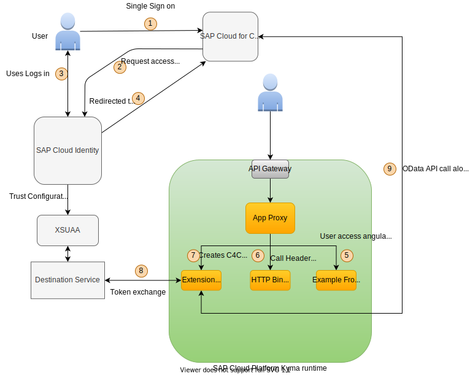

# Overview



## Steps

- Create Destination Service instance
- Deploy c4c-extension
- Create xsuaa instance
- Create trust between SCP and IAS
- Deploy auth proxy
- Deploy httpbin.

  ```shell script
  kubectl -n identity-propagation-via-xsuaa apply -f https://raw.githubusercontent.com/istio/istio/master/samples/httpbin/httpbin.yaml
  ```

## To DO

- [x] Put the modified angular app in this directory
- [x] Update the proxy so that `/api` is not required in the path
- [ ] The c4c-extension-with-user-context is not providing a proper response when a 401 occurs, UI receives 201 (login with uaa user to test)
- [ ] Can the login screen be configured to only allow IAS auth, may be a property in xsuaa instance config?
