# Sample to extend SAP Cloud for Customer with user propagation

## Overview

This sample provides details on how a user propagation flow can be achieved when extending SAP Cloud for Customer(C4C) using SAP BTP, Kyma runtime. A similar configuration is applicable when extending other SAP Solutions such as S4.

The flow uses SAP Identity Authentication Service (IAS) as an external identity provider with user federation. However, any external identity provider would also work as long as it supports SAML 2.0.

The user propagation relies on the exchange of the JWT token received in Kyma for an OAuth2 token that can be authenticated by SAP Cloud for Customer. For this, the [Destination Service](https://help.sap.com/viewer/cca91383641e40ffbe03bdc78f00f681/Cloud/en-US/7e306250e08340f89d6c103e28840f30.html) is used.

Trust is established between SAP Cloud for Customer and Destination Service. The extension deployed in Kyma runtime makes an [API call](https://api.sap.com/api/SAP_CP_CF_Connectivity_Destination/resource) to the destination service passing the JWT token. Destination Service after validating the token responds along with other details an opaque OAuth2 token for the logged-in user. This OAuth2 token is then used to make calls to the SAP Cloud for Customer ODATA APIs.

## Flow

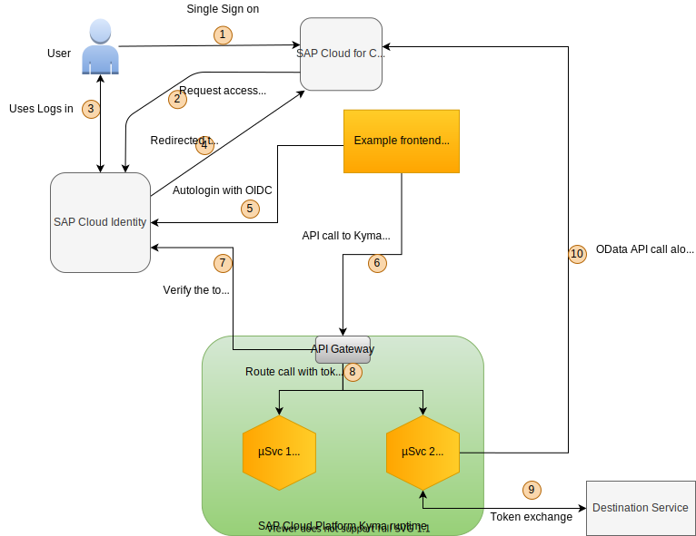

1. User signs in to C4C with a single ID and password (SSO).
2. C4C redirects the user to IAS for authentication.
3. User signs in to IAS.
4. User is signed in to C4C with SAML bearer assertion.
5. User accesses the frontend. The frontend can be a mesh inside C4C or a standalone app hosted on Kyma or somewhere else. The frontend redirects the user to IAS for automatic login. Along with the autologin request, the frontend receives the bearer token.
6. The frontend makes an API call to Kyma with the bearer token.
7. Kyma API Gateway verifies the token with IAS.
8. API Gateway forwards calls to a Function/microservice along with the bearer token. **Token forwarding is made possible by adding an attribute to the Kyma API rule.**
9. Microservice/Function does the token exchange via the Destination Service. The Destination Service calls C4C and performs the OAuth2 SAML bearer assertion flow.
10. Microservice/Function makes a call to C4C with the OAuth2 token it got from the Destination Service, preserving the logged-in user's identity.

>> **NOTE:** The flow does not use Application Gateway when calling C4C from the Kyma runtime. Instead, it calls the APIs directly.

## Prerequisites

- SAP BTP, Kyma runtime instance
- SAP Cloud for Customer tenant
- SAP Identity Authentication Service tenant
- OAuth 2.0-based authentication between IAS, SAP BTP, and C4C requires the same user ID to exist in both IAS and C4C.

## Configuration

### Single sign-on

Set up single sign-on (SSO) using IAS with C4C. Refer to the [official documentation](https://help.sap.com/viewer/abfba1342cfb4832ab722fa041f6c4b7/CLOUD/en-US/f1e6f23267b542ce9a906823c70dc583.html) for details.

### User propagation

Configure user propagation between C4C and Kyma runtime.

[This blog](https://blogs.sap.com/2017/11/14/configuring-oauth-2.0-between-sap-hybris-cloud-for-customer-and-sap-cloud-platform/) was used as a reference. It was written for Neo, but some steps are also applicable for Kyma runtime.

You will end up creating a Destination Service in SAP BTP. It will be later on used by the microservice to do the token exchange.

- Download the `Trust` certificate from **Subaccount** --> **Destinations** --> **Download Trust**.
  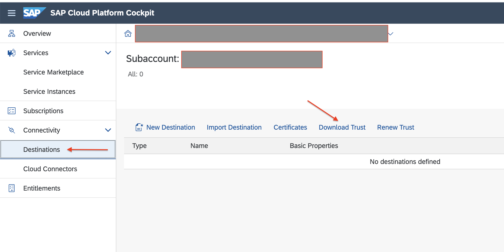

- Log on to your C4C system as an administrator. Go to **ADMINISTRATOR** --> **Common Tasks**. Choose **Configure OAuth 2.0 Identity Provider** and select **New OAuth2.0 Provider**.

  - Get the issuing entity name from the certificate. You can use OpenSSL to view certificate details.

      ```shell
      openssl x509 -in {cert path} -text -noout
      ```

  - Upload the certificate.
    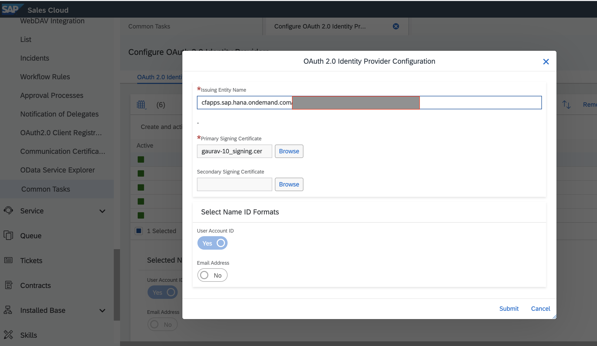

- Register an Oauth2 Client in C4C.
  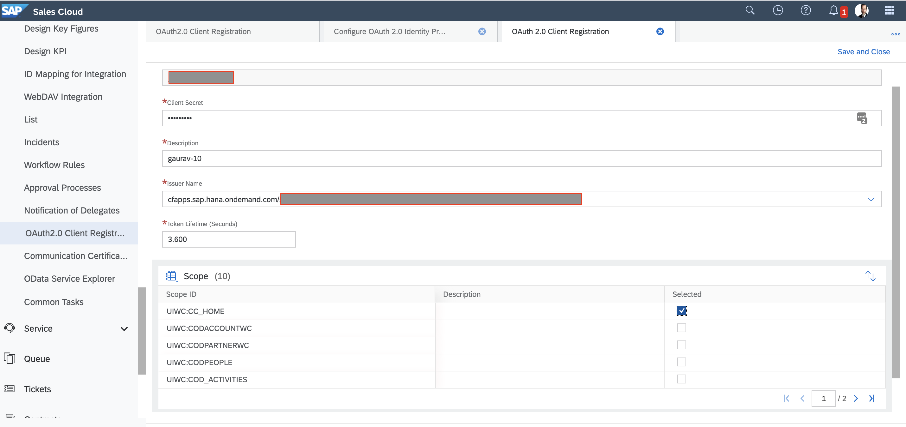

- Create a destination in SAP BTP. Under your subaccount, go to **Connectivity** --> **Destinations**.
  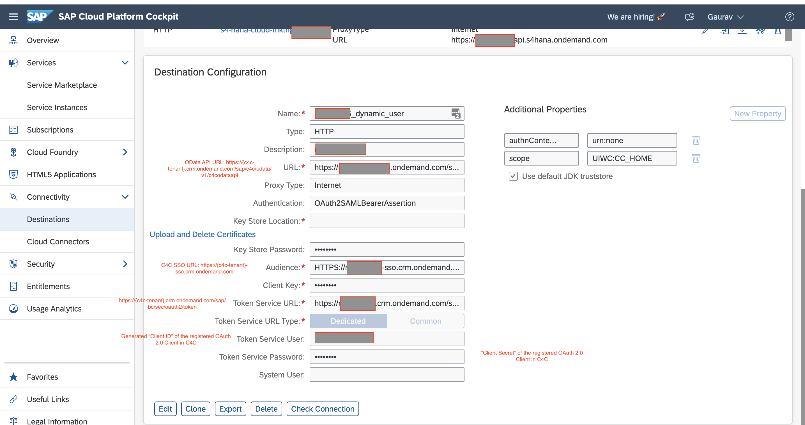

  Configure these additional properties:
  
    ```shell
    scope : UIWC:CC_HOME
    x_user_token.jwks_uri : "Provide URI of the JSON web key set"
    ```

### Identifier used by the Destination Service to get the token

The Destination Service uses whatever is specified in the `userIdSource` property. If not specified, it would require either `user_name` or `email` depending upon the `nameIdFormat`
In this example, `user_name` is mapped to the **Login name** attribute.

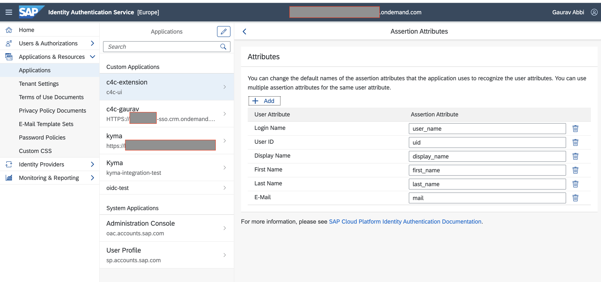

## Components for the sample

Create Namespace

```shell script
kubectl create ns identity-propagation
kubectl label namespaces identity-propagation istio-injection=enabled
```

### httpbin

httpbin is a service that returns all the request headers to the `/headers` endpoint.

It is used for demonstrating and verifying that the token is forwarded from the API Gateway to the microservice.

- Deploy httpbin.

    ```shell
    kubectl -n identity-propagation apply -f https://raw.githubusercontent.com/istio/istio/master/samples/httpbin/httpbin.yaml
    ```

- Expose it with an [API rule](k8s/apirule-httpbin.yaml). The API rule is configured to forward headers, such as `Bearer Token`, to the microservice.
  [api-rule-forward-headers](assets/apirule-forward-headers.png)

  - Update `jwks_urls` and `trusted_issuers` with the IAS tenant.

  - Deploy the API rule.

      ```shell
      kubectl -n identity-propagation apply -f k8s/apirule-httpbin.yaml
      ```

### Extension

The second microservice is the one that implements the extension logic and where the user propagation happens.

- It receives the JWT token that is forwarded from the API Gateway.
- The token is used to do a token exchange by making API Call to the Destination Service.
- A call is made to C4C to create a task with the exchanged token that contains the user context.
- The task is created with the logged-in user as the processor, not a static user.

**Token Exchange**

The token exchange is done by making API calls to destination service. The configuration has been done in SAP, BTP in previous steps and an instance has been created on Kyma Service Catalog. The created instance provides the necessary credentials and call details (OAuth URL, API enpoint)

The token exchange call looks like below:

```shell
curl --location --request GET '{uri-in-destination-service-instance-in-kyma-service-catalog}/destination-configuration/v1/destinations/{destination-name-in-BTP}' \
  --header 'X-user-token: {JWT-token-to-be-exchanged}' \
  --header 'Authorization: Bearer {OAuth-token}'
```

You can get the OAuth token by using the credentials provided in destination service instance created in Kyma Service Catalog.
Use the `URL + /oauth/token ` as the token endpoint and client id and client secret as credentials.


#### Setup

- Create a Destination Service instance in the Kyma Service Catalog. This will be used to get the credentials to make the call to the Destination Service.

  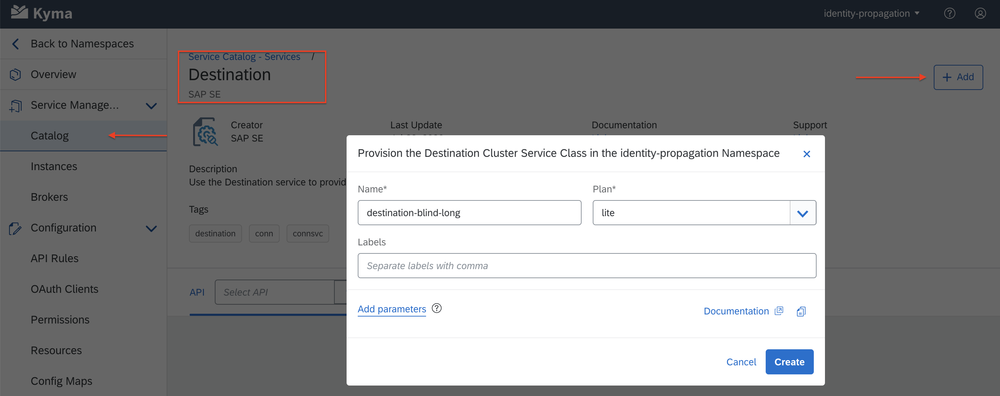

- Create credentials for the instance.

  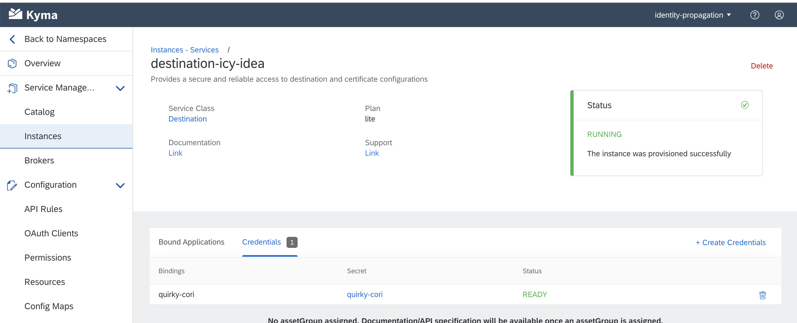

- Deploy the extension with user propagation.

  - Update `DESTINATION_NAME` in [`deployment.yaml`](c4c-extension-with-user-context/k8s/deployment.yaml) with the name of the destination created in SAP BTP.

  - Deploy the extension.

      ```shell
        kubectl apply -f c4c-extension-with-user-context/k8s/deployment.yaml
      ```

- Bind the extension to the Destination Service instance.
  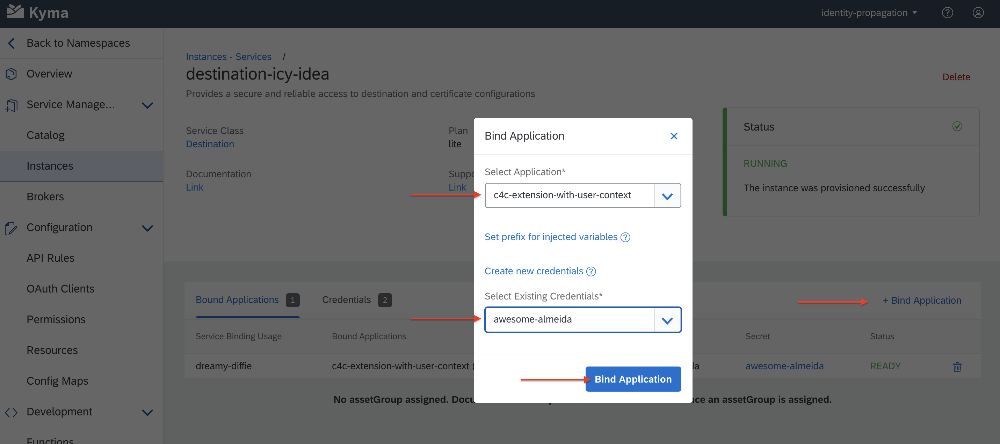

- Expose it with an [API rule](c4c-extension-with-user-context/k8s/api-rule.yaml). Similarly to `httpbin`, the API rule is configured to forward headers, such as `Bearer Token`, to the microservice.

  - Update `jwks_urls` and `trusted_issuers` with the `SAP Cloud Identity` tenant.

  - Deploy the API rule.

      ```shell
        kubectl -n identity-propagation apply -f c4c-extension-with-user-context/k8s/apirule.yaml
      ```

### Angular app

It simulates the SSO flow and makes API calls to the extensions deployed to the Kyma runtime.

The app automatically logs the user in after they have been signed into C4C through SSO. It is registered in the IAS as an application.
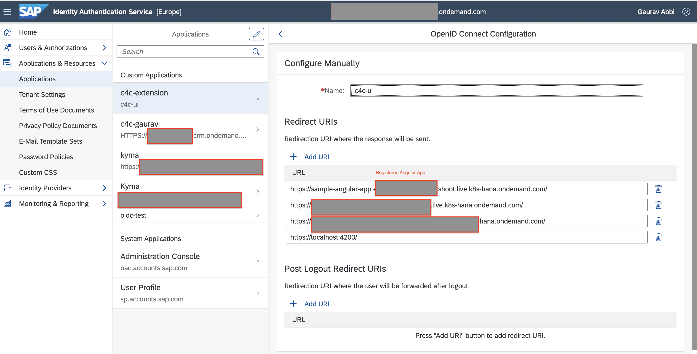

The app makes a call to the httpbin service to the `/headers` URI path. The httpbin service replies with all the HTTP headers received.

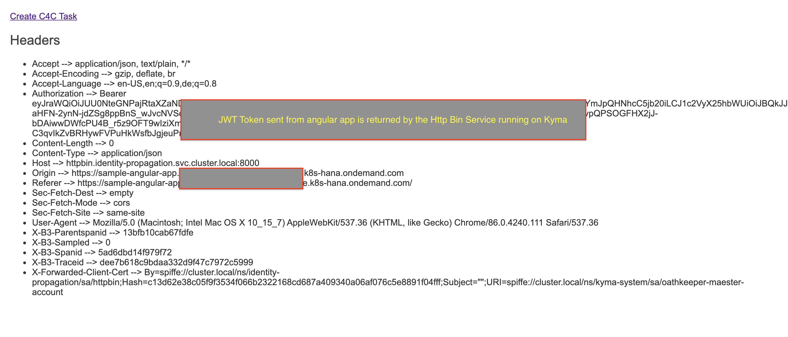

It makes another call to create a C4C task for the logged-in user.

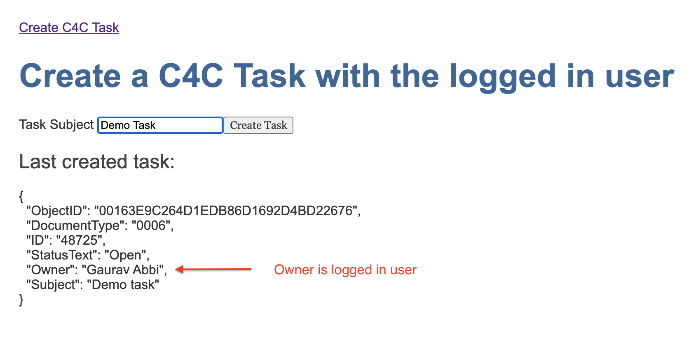

#### Set up the angular app

Follow these steps:

- Update the [deployment file](k8s/angular-app.yaml). Provide values for `HTTP_BIN`, `OIDC_URL`, `OIDC_CLIENT_ID` and `C4C_EXT_URL`.

  - `OIDC_CLIENT_ID` is the Client Id for the registered application in SAP Identity Authentication Service tenant.

- Deploy the app:

    ```shell
    kubectl -n identity-propagation apply -f k8s/angular-app.yaml
    ```

- Expose the app using an API Rule:

    ```shell
    kubectl -n identity-propagation apply -f k8s/apirule-angular-app.yaml
    ```

- Access the app at `https://sample-angular-app.{kyma-cluster-domain}`.`

### UI5 App

It is another sample app in case you want to try out the example with UI5 instead of angular. The flow remains the same.

- Modify the config.json to match your configuration

**Running locally**

- To run locally, within the folder `ui5-example-app` run the commands to install, build the dependencies, and start the application

    ```shell
    npm install
    ```

    ```shell
    npm run build-all
    ```

    ```shell
    npm run start
    ```

- App will be available at `http://localhost:8080/index.html`

**Docker**

- To build and push the docker image run the following commands from the folder `ui5-example-app`

    ```shell
    docker build -t {your-docker-account}/kyma-identity-propagation-ui5 -f Dockerfile .
    docker push {your-docker-account}/kyma-identity-propagation-ui5
    ```

- To run the image locally, adjust the values of the parameters in the `webapp/config.js` file and mount it into the image:

    ```shell
    docker run --mount type=bind,source=$(pwd)/webapp/config.json,target=/usr/share/nginx/html/config.json -p 8080:80 -d {your-docker-account}/kyma-identity-propagation-ui5:latest
    ```

- App will be available at `http://localhost:8080/`

**Deploying to Kyma**

- Create the configmap from the file `ui5-example-app/webapp/config.json`

    ```shell
    kubectl create configmap kyma-identity-propagation-ui5 --from-file=webapp/config.json -n identity-propagation
    ```

- Apply the deployment and the apirule found in the `k8s` folder

    ```shell
    kubectl apply -f ui5-app.yaml -n identity-propagation
    ```

    ```shell
    kubectl apply -f apirule-ui5-app.yaml -n identity-propagation
    ```

## Takeaways

- It is possible to build in the Kyma runtime the extensions and flows that require user propagation. This feature has been requested by various customers.
- Although the sample is built for SAP Cloud for Customer, a similar approach can be applied to other SAP Solutions, such as SuccessFactors.
- The approach requires an extension to build the logic required to fetch the token.
- The flow does not make the call via Application Gateway but directly calls the SAP Cloud For Customer APIs with the token it got from the Destination Service.
